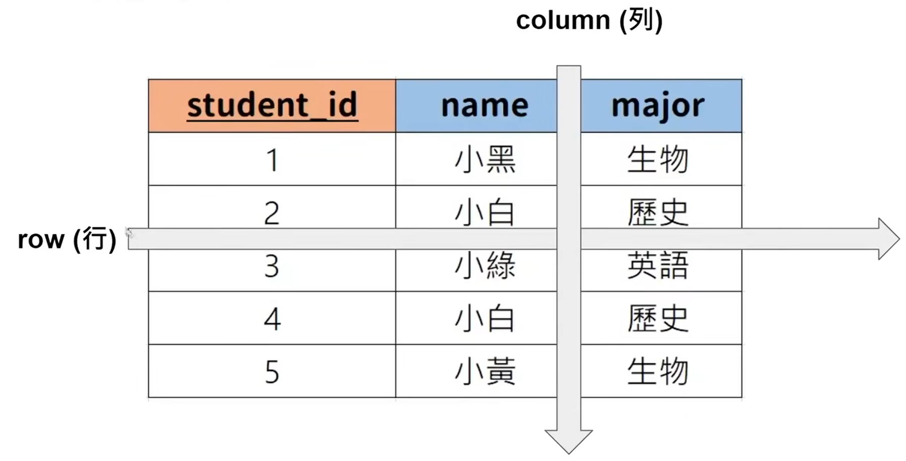
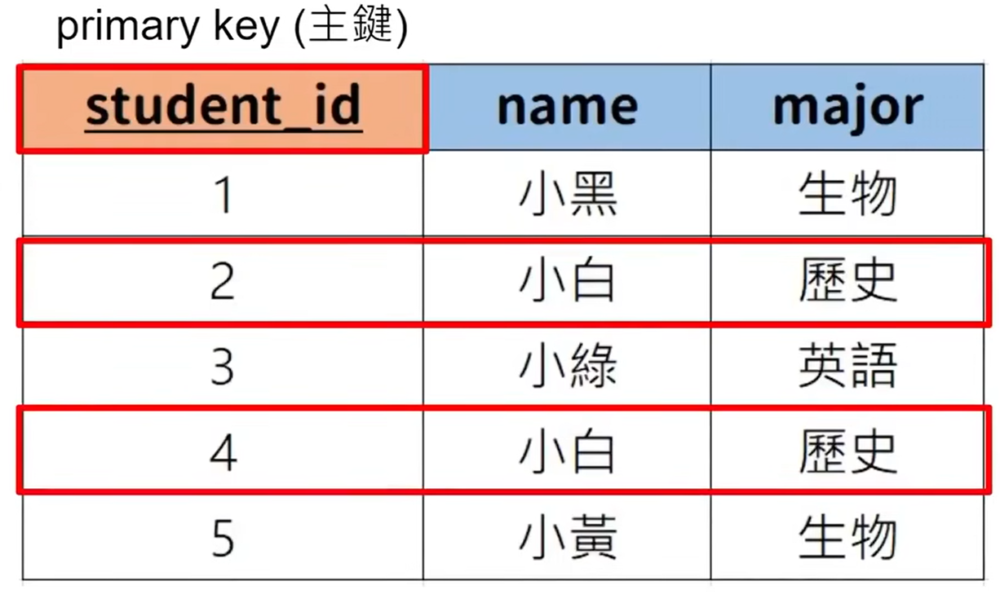
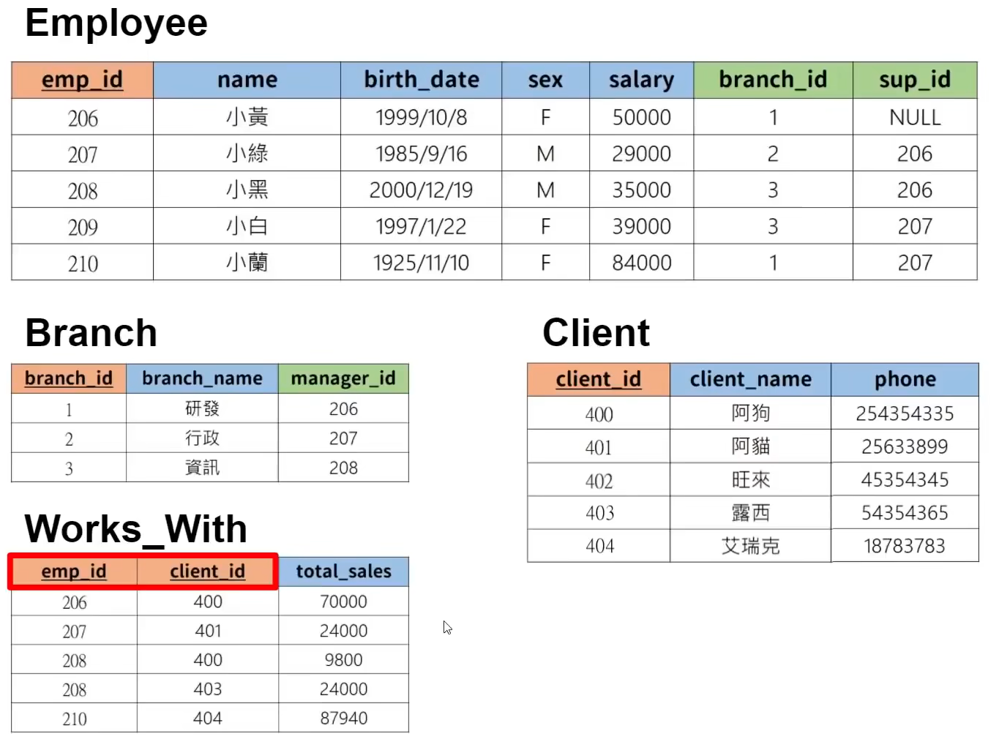
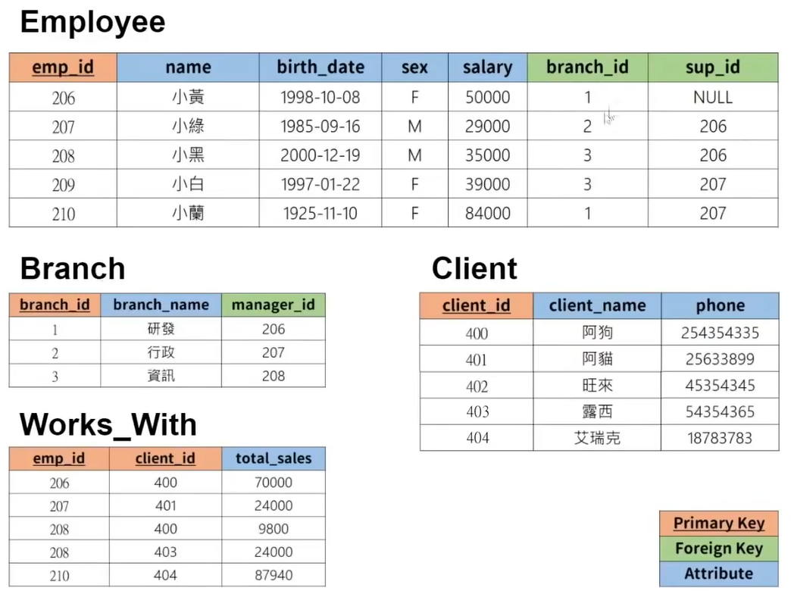
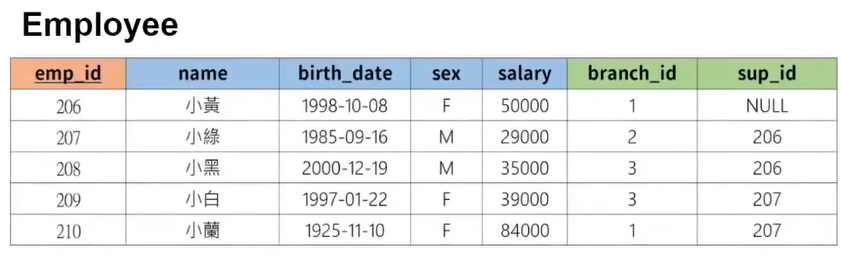
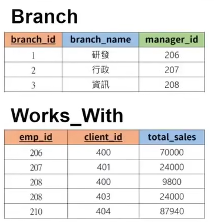

# 基本概念

## 表格和键

举例：



这样一个表，一行表示一条数据，一列代表一个属性。



主键（primary key）：这个属性可以唯一的表示每一条记录。

外键（foreign key）：对应其他表格中的主键。不但可以对应到别的表格，也可以对应回自己的表格。


一个实际的例子



这里的Works_With表存在两个主键，因为这三个属性，不论是哪个属性都不能表示同一条记录，所以此时可以设定两个及以上的主键。这表示，只要把这两个主键属性看在一起，就可以唯一的表示每一条记录。

这两个主键还同样都是外键，都对应其他表格的主键。


## 基本的SQL指令

创建一个数据库

```mysql
CREATE DATABASE `sql_tutorial`;
```

显示所有的数据库

```mysql
SHOW DATABASES;
```

删除特定数据库

```mysql
DROP DATABASE `sql_tutorial`;
```

选择使用的数据库

```mysql
USE `sql_tutorial`;
```


创建数据库中的表格

- 创建表格时需要设定每个属性的数据形态；最常见的6种如下。


INT								--整数
DECIMAL(m,n)			--有小敷黜的敷（两个参数，第一个参数m表示总共有几位数，第二个参数n代表小数点部分占了几位）
VARCHAR(n)				--字符串（1个参数，最多传入几个字节）
BLOB							-- (Binary Large Object) 主要用于存放二进制数据的。例如图片 影片 档案...
DATE							-- 'YYYY-MM-DD’ 主要用于记录日期；例如2021-08-08
TIMESTAMP				-- "YYYY-MM-DD HH : MM: SS’ 主要用于记录时间

假设创建一个STUDENT的表格。

```mysql
CREATE TABLE `student`(
	`student_id` INT PRIMARY KEY,
    `name` VARCHAR(20),
    `major` VARCHAR(20)
);
```

主键的另外一种写法：

```mysql
CREATE TABLE `student`(
	`student_id` INT,
    `name` VARCHAR(20),
    `major` VARCHAR(20),
    PRIMARY KEY(`student_id`)
);
```


查看表格

```mysql
DESCRIBE `student`;
```


删除表格

```mysql
DROP TABLE `student`;
```


新增一个GPA的属性

```mysql
ALTER TABLE `student` ADD gpa DECIMAL(3,2);
```


删除一个表格中的GPA的属性

```mysql
ALTER TABLE `student` DROP COLUMN gpa;
```


## 如何存入数据

存入数据。例如，我们想要存入一位学生。id是1，名字是“小白”，主修“历史”。

```mysql
INSERT INTO `student` VALUES(1, "小白", "历史");
```

这句语句表示存入一条记录，到`student`表格里面，三个属性分别是1，小白，历史。

```mysql
INSERT INTO `student` VALUES(2, "小黑", NULL);
```


**注意，INSERT时，PRIMARY KEY不能重复。否则会报错。**


列出所有的数据

```mysql
SELECT * FROM `student`;
```

这句语句表示 搜寻`student`表格里面的所有数据。*表示全部。


自定义填入属性的顺序

```mysql
INSERT INTO `student`(`name`, `major`, `student_id`) VALUES("小蓝", "英语", 4); 
```

或者：

```mysql
INSERT INTO `student`(`major`, `student_id`) VALUES("英语", 5); 
```

若不指定属性，则默认填充为NULL。


## 约束、限制

在创建表格的时候可以为属性添加约束，例如：

```mysql
CREATE TABLE `student`(
	`student_id` INT,
    `name` VARCHAR(20) NOT NULL,
    `major` VARCHAR(20) UNIQUE,
    PRIMARY KEY(`student_id`)
);
```

NOT NULL表示这个属性值不可为空，

UNIQUE表示这个属性值不可以重复，唯一。

AUTO_INCREMENT自动增加 可用于ID，

亦可以为DEFAULT指定预设值：

```mysql
CREATE TABLE `student`(
	`student_id` INT AUTO_INCREMENT,
    `name` VARCHAR(20),
    `major` VARCHAR(20) DEFAULT '历史',  # 这里用单引号双引号都可以
    PRIMARY KEY(`student_id`)
);
```

这样，就可以在新增一条记录时自动将`student_id`属性+1，同时，若不指定`major`属性值则默认为`历史`。


## 修改、删除数据

先把workbench预设的更新模式关闭

```mysql
SET SQL_SAFE_UPDATES = 0;
```


将表格中`major`属性为生物和化学的属性名都改为`生化`。（生物、化学系合并）

```mysql
UPDATE `student`
SET `major` = '生化'
WHERE `major` = '生物' OR `major` = '化学';
```

也可以改变多个属性

```mysql
UPDATE `student`
SET `name` = '小灰', `major` = '物理'
WHERE `student_id` = 1;
```

如果不指定WHERE增加条件，而是：

```mysql
UPDATE `student`
SET `major` = '物理';
```

则会把表格中所有`major`属性改为"物理"。


删除数据的写法和新增的写法类似。


要删除表格`student`中`student_id`为4的数据。

```mysql
DELETE FROM `student`
WHERE `student_id` = 4;
```

同样地。条件也可以是多个：

```mysql
DELETE FROM `student`
WHERE `name` = '小灰' AND `major` = '物理';
```

或者，删除分数小于60的记录：

```mysql
DELETE FROM `student`
WHERE `score` < 60;
```

这里的运算符可以是：

```
> 大于
< 小于
>=/<= 大于等于/小于等于
= 等于
<> 不等于
```


若不指定条件：

```mysql
DELETE FROM `student`;
```

则默认把`student`表格里的所有数据都删除。


## 搜索数据

取得表格`student`中所有数据：

```mysql
SELECT * FROM `student`;
```

这里的*表示所有的属性的意思。


只想取得特定的`name`属性：

```mysql
SELECT `name` FROM `student`;
```


### ORDER BY 获取并排序

可以在获取数据的时候对数据进行排序。

例如，根据学生的成绩排序：

```mysql
SELECT *
FROM `student`
ORDER BY `score`;
```


此时，ORDER BY后面默认省略了 ASC，

若想反向排序，使用DESC：

```mysql
SELECT *
FROM `student`
ORDER BY `score` DESC;
```


ORDER BY后面可以加多个属性，例如：

```mysql
SELECT *
FROM `student`
ORDER BY `score`, `student_id`;
```

意思是，先根据score进行排序，若score属性值相等，再根据student_id属性来排序。


### LIMIT 限定传回条数

如果我们觉得使用SELECT获取数据时，回传回来的数据太多了，不想要那么多条，

我们可以使用LIMIT限定传回的数据条数。


LIMIT也可以和ORDER BY一起使用：


### WHERE 限定获取数据的条件


也可以使用IN关键字：


以上两句作用等同。


### DISTINCT 去重


# 创建一个公司部门的数据库




## 创建所有表格

创建 员工 表格

```mysql
CREATE TABLE `employee`(
	`emp_id` INT PRIMARY KEY,
    `name` VARCHAR(20),
    `birth_date` DATE,
    `sex` VARCHAR(1),
    `salary` INT,
    `branch_id` INT,
    `sup_id` INT
);
```


创建 部门 表格

```mysql
CREATE TABLE `branch`(
	`branch_id` INT PRIMARY KEY,
    `name` VARCHAR(20),
    `manager_id` INT,
    FOREIGN KEY(`manager_id`) REFERENCES `employee`(`emp_id`) ON DELETE SET NULL
);
```


补充刚刚 员工 表格 中少设定的foreign key

```mysql
ALTER TABLE `employee`
ADD FOREIGN KEY(`branch_id`)
REFERENCES `branch`(`branch_id`)
ON DELETE SET NULL;

ALTER TABLE `employee`
ADD FOREIGN KEY(`sup_id`)
REFERENCES `employee`(`emp_id`)
ON DELETE SET NULL;
```


创建 客户 表格

```mysql
CREATE TABLE `client`(
	`client_id` INT PRIMARY KEY,
    `client_name` VARCHAR(20),
    `phone` VARCHAR(20)
);
```


创建 Works With 表格

```mysql
CREATE TABLE `works_with`(
	`emp_id` INT,
    `client_id` INT,
    `total_sales` INT,
    PRIMARY KEY(`emp_id`, `client_id`),
    FOREIGN KEY(`emp_id`) REFERENCES `employee`(`emp_id`) ON DELETE CASCADE,
    FOREIGN KEY(`client_id`) REFERENCES `client`(`client_id`) ON DELETE CASCADE
);
```


## 向表格中填充数据

由于employee表格和branch表格互相都有外键，所以可以先将外键的部分填为NULL，再做连接。


向 部门 表格中添加数据

```mysql
INSERT INTO `branch` VALUES(1, '研发', NULL);
INSERT INTO `branch` VALUES(2, '行政', NULL);
INSERT INTO `branch` VALUES(3, '资讯', NULL);
```


新增 5条 员工 的数据

```mysql
INSERT INTO `employee` VALUES(206, '小黄', '1998-10-08', 'F', 50000, 1, NULL);
INSERT INTO `employee` VALUES(207, '小绿', '1985-09-16', 'M', 29000, 2, 206);
INSERT INTO `employee` VALUES(208, '小黑', '2000-12-19', 'M', 35000, 3, 206);
INSERT INTO `employee` VALUES(209, '小白', '1997-01-22', 'F', 39000, 3, 207);
INSERT INTO `employee` VALUES(210, '小蓝', '1925-11-10', 'F', 84000, 1, 207);
```


把 部门 表格的 manager_id 改回来

```mysql
UPDATE `branch`
SET `manager_id` = 208
WHERE `branch_id` = 3;
```


新增 客户 数据

```mysql
INSERT INTO `client` VALUES(400, '阿狗', '254354335');
INSERT INTO `client` VALUES(401, '阿猫', '234242423');
INSERT INTO `client` VALUES(402, '旺来', '45234234');
INSERT INTO `client` VALUES(403, '露西', '5312343424');
INSERT INTO `client` VALUES(404, '艾瑞克', '1423432423');
```


新增 works_with 数据

```mysql
INSERT INTO `works_with` VALUES(206, 400, '70000');
INSERT INTO `works_with` VALUES(207, 401, '24000');
INSERT INTO `works_with` VALUES(208, 402, '9800');
INSERT INTO `works_with` VALUES(209, 403, '24000');
INSERT INTO `works_with` VALUES(210, 404, '87940');
```


至此。一个公司的数据库已经获取完毕。


# 练习

练习一下刚刚学习的SQL语句。


1. 取得所有员工资料
2. 取得所有客户资料
3. 按薪水从低到高取得员工资料
4. 取得薪水前3高的员工
5. 取得所有员工的名字
6. 取得所有员工的性别（不重复）


解：

```mysql
SELECT * FROM `employee`;
```

```mysql
SELECT * FROM `client`;
```

```mysql
SELECT * 
FROM `employee`
ORDER BY `salary`;
```

```mysql
SELECT * 
FROM `employee`
ORDER BY `salary` DESC
LIMIT 3;
```

```mysql
SELECT `name`
FROM `employee`
```

```mysql
SELECT DISTINCT `sex` FROM `employee`;
```


# 聚合函数

可以更方便的获取数据库中的数据。

1. 获取员工人数
2. 获取所有出生于1970-01-01之后的女性员工人数
3. 获取所有员工的平均薪水
4. 获取所有员工薪水的总和
5. 获取薪水最高的员工
6. 获取薪水最低的员工


实现方式如下

1 获取员工人数

```mysql
SELECT COUNT(*) FROM `employee`;
```

这条语句表示，去`employee`这张表格里看有几条记录。

若不使用*而是具体的属性：

```mysql
SELECT COUNT(`sup_id`) FROM `employee`;
```

表示`employee`表格中有这个`sup_id`属性的数据共有几条**（NULL不计数）**。


2 获取所有出生于1970-01-01之后的女性员工人数

```mysql
SELECT COUNT(*) 
FROM `employee` 
WHERE `birth-date` > '1970-01-01' AND `sex` = 'F';
```


3 获取所有员工的平均薪水

```mysql
SELECT AVG(`salary`) FROM `employee`;
```

这样会算`salary`属性所有值的平均数。


4 获取所有员工薪水的总和

```mysql
SELECT SUM(`salary`) FROM `employee`;
```


5 获取薪水最高的员工

```mysql
SELECT MAX(`salary`) FROM `employee`;
```


6 获取薪水最低的员工

```mysql
SELECT MIN(`salary`) FROM `employee`;
```


# wildcards 通配符

```
% 代表多个字节
_ 代表一个字节
```


1. 获得电话号码尾数是335的客户；
2. 获得姓艾的客户；
3. 获得生日在12月的员工。


实现方式如下：

1 获得电话号码尾数是335的客户；

```mysql
SELECT * FROM `client` WHERE `phone` LIKE `%335`;
```

其中，LIKE是模糊查询。


2 获得姓艾的客户；

```mysql
SELECT * FROM `client` WHERE `client_name` LIKE `艾%`;
```


3 获得生日在12月的员工。

```mysql
SELECT * FROM `client` WHERE `birth_date` LIKE `_____12%`;
```

当然，这里的匹配字符也可以是`%-12-%`等等，根据需求来确定就好。


# union 并集

1. 员工名字 union 客户名字
2. 员工id + 员工名字 union 客户id + 客户名字
3. 员工薪水 union 销售金额


实现方式如下：

1 员工名字 union 客户名字

```mysql
SELECT `name`
FROM `employee`
UNION
SELECT `client_name`
FROM `client`;
```

这样可以把两个查询的结果结合到一起。**相当于UNION把SELECT的合并到一列。**

也可以结合2个以上的多个。

注意：合并时，属性的形态（数据类型）和个数要一致。


2 员工id + 员工名字 union 客户id + 客户名字

```mysql
SELECT `emp_id`, `name`
FROM `employee`
UNION
SELECT `client_id`, `client_name`
FROM `client`;
```

这时回传的属性名称是用的第一个回传的名称。可以使用AS修改回传的属性名：

```mysql
SELECT `emp_id` AS `total_id`, `name` AS `total_name`
FROM `employee`
UNION
SELECT `client_id`, `client_name`
FROM `client`;
```


3 员工薪水 union 销售金额

```mysql
SELECT `salary` AS `total_money`
FROM `employee`
UNION
SELECT `total_sales`
FROM `works_with`;
```


# join 连接

1. 获得所有部门经理的名字

branch表格中，只有部门经理的id，没有名字。因此，可以考虑先拼接表格再获取。


实现方式如下：

```mysql
SELECT *
FROM `employee`
JOIN `branch`
ON `emp_id` = `manager_id`;
```


可是我们需要的只是经理的名字，不需要这么多数据。

```mysql
SELECT `emp_id`, `name`, `branch_name`
FROM `employee`
JOIN `branch`
ON `emp_id` = `manager_id`;
```

如果，存在不同的表格中有相同的属性名，需要用`.`来区分不同的属性来自哪张表：

```mysql
SELECT `emp_id`, `employee`.`name`, `branch`.`name`
FROM `employee`
JOIN `branch`
ON `employee`.`emp_id` = `branch`.`manager_id`;
```


这时，可以用LEFT JOIN：

```mysql
SELECT `emp_id`, `employee`.`name`, `branch`.`name`
FROM `employee` LEFT JOIN `branch`
ON `employee`.`emp_id` = `branch`.`manager_id`;
```

LEFT JOIN的意思是，当我们连接的时候，不管ON后面的条件成不成立，**左边的表格都会回传给我们**，只有当右边的表格只有当条件成立才传回，不成立的地方回传NULL。


RIGHT JOIN同理。


# subquery 子查询

可以在一个查询语句里面使用另外一个查询语句的结果。

可以使用括号。


1. 找出研发部门的经理名字；
2. 找出对单一客户销售金额超过50000的员工名字。


实现方式如下：

1 找出研发部门的经理名字；

```mysql
SELECT `name`
FROM `employee`
WHERE `emp_id` = (
	SELECT `manager_id`
    FROM `branch`
    WHERE `branch_name` = '研发'
);
```


2 找出对单一客户销售金额超过50000的员工名字。

```mysql
SELECT `name`
FROM `employee`
WHERE `emp_id` IN (
	SELECT `emp_id` 
	FROM `works_with` 
	WHERE `total_sales` > 50000
);
```

这里应当用IN，因为子查询返回了多个结果。


# ON DELETE

之前创建表格的时候使用了ON DELETE，作用是什么？

先看刚刚创建时使用了ON DELETE的例子：

1. 创建部门表格

```mysql
CREATE TABLE `branch`(
	`branch_id` INT PRIMARY KEY,
    `name` VARCHAR(20),
    `manager_id` INT,
    FOREIGN KEY(`manager_id`) REFERENCES `employee`(`emp_id`) ON DELETE SET NULL
);
```

2. 创建works_with表格

```mysql
CREATE TABLE `works_with`(
	`emp_id` INT,
    `client_id` INT,
    `total_sales` INT,
    PRIMARY KEY(`emp_id`, `client_id`),
    FOREIGN KEY(`emp_id`) REFERENCES `employee`(`emp_id`) ON DELETE CASCADE,
    FOREIGN KEY(`client_id`) REFERENCES `client`(`client_id`) ON DELETE CASCADE
);
```





上述两个指令分别创建了外键指向employee表格的两个表格，一个是branch，一个是works_with。

设想如下情形：当员工小绿离职了，即从employee中删除了emp_id=207，nam=小绿的这条数据，branch表和works_with表分别会做什么？这取决于创建时ON DELETE设定。

ON DELETE CASCADE表示删除时一起删掉，ON DELETE SET NULL表示删除时设为NULL。

也就是说，由于创建时制定了branch的外键是ON DELETE SET NULL，当employee表格中删除了小绿，branch中对应branch_id=2也就是小绿的manager_id的值就会设为NULL；works_with表中207一行会被删除。

**注意：Works_With表中的emp_id对应的ON DELETE不能设置为NULL！（否则会报错！）因为emp_id同时作为works_with表的主键，主键不可以是NULL。**


我们删除试试看：

```mysql
DELETE FROM `employee` 
WHERE `emp_id` = 207;
```

```mysql
SELECT *
FROM `branch`;
```


可以看到，manager_id下对应的值为NULL了。


# python连接MySQL

需要安装依赖：

```bash
pip install mysql-connector-python
```


基本使用就是用cursor来执行sql指令。

例如：

```python
import mysql.connector

connection = mysql.connector.connect(host='localhost',
                                     port='3306',
                                     user='root',
                                     password='zyl12345',
                                     database='sql_tutorial'
                                     )

cursor = connection.cursor()

# 获取部门表格所有数据
cursor.execute('SELECT * FROM `branch`;')

records = cursor.fetchall()
for r in records:
    print(r)

cursor.close()
connection.close()

```


## connection.commit()

当需要修改数据库资料的，比如新增、修改、删除，需要他增加一句：

```python
connection.commit()
```

**只有使用了commit()才会提交出去，修改操作才会生效！**

例如：

```python
import mysql.connector

connection = mysql.connector.connect(host='localhost',
                                     port='3306',
                                     user='root',
                                     password='zyl12345',
                                     database='sql_tutorial'
                                     )

cursor = connection.cursor()

# 新增
cursor.execute("INSERT INTO `branch` VALUES(5, 'qq', NULL);")

# 修改
cursor.execute("UPDATE `branch` SET `manager_id` = NULL WHERE `branch_id` = 4;")

# 删除
cursor.execute("DELETE FROM `branch` WHERE `branch_id` = 5;")

cursor.close()
connection.commit()
connection.close()
```

**只有使用了commit()才会提交出去，修改操作才会生效！**


完结。


